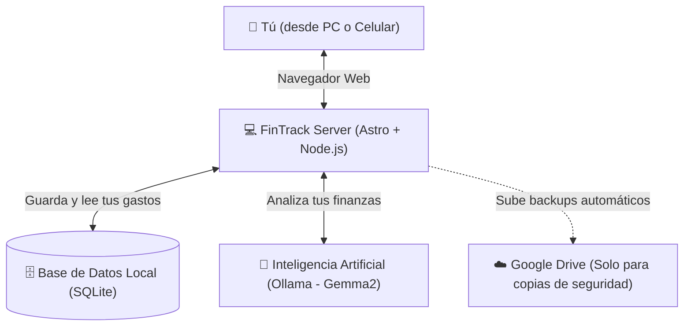

# 💻 FinTrack — Tu Asistente Financiero Personal Privado

¡Bienvenido a **FinTrack**! Una aplicación web diseñada para que tomes el control absoluto de tus finanzas personales. A diferencia de otras aplicaciones financieras, FinTrack vive **100% en tu propia computadora o red local**, lo que significa que **nadie más tiene acceso a tus datos financieros**.

Además, cuenta con una estética única estilo "terminal hacker" retro y un asistente de Inteligencia Artificial que te ayuda a auditar tus gastos.

---

## 🔍 ¿Para qué sirve?

FinTrack es una herramienta completa para tu día a día, y te ayuda a:

1. **Registrar ingresos y gastos** de forma rápida y sencilla.
2. **Definir presupuestos mensuales** para que sepas exactamente cuánto puedes gastar en cada categoría (ej. Comida, Transporte, Ocio).
3. **Fijar objetivos de ahorro** (bolsillos) para tus metas futuras, calculando de manera automática cuánto necesitas ahorrar cada mes para lograrlo a tiempo.
4. **Obtener consejos con Inteligencia Artificial**: Un agente inteligente local llamado "Moneypenny" analiza tus hábitos de consumo, detecta "gastos hormiga" y te sugiere cómo ahorrar más.
5. **Visualizar tus finanzas**: Con gráficos interactivos y claros para entender a dónde se va tu dinero.

---

## 🏗️ ¿Cómo funciona y cómo se construyó?

FinTrack está construido con tecnologías modernas pero enfocadas en tu privacidad y en la velocidad. No dependes de servidores de terceros ni de nubes públicas para procesar tus datos.



**Tecnologías principales con las que fue construido:**
* **Interfaz y Servidor:** Creado con **Astro**, **React** y **TailwindCSS** para ser extremadamente rápido y verse increíble tanto en celulares como en pantallas grandes.
* **Almacenamiento:** **SQLite**, una base de datos ultrarrápida que guarda todo en un solo archivo dentro de tu computadora (`fintrack.db`).
* **Inteligencia Artificial:** **Ollama**, que ejecuta un cerebro artificial avanzado (Gemma2 de 9 billones de parámetros) en tu propio equipo, sin enviar tus datos a internet.

---

## 🚀 ¿Cómo implementarlo y usarlo? (Guía de Instalación)

Para usar FinTrack en tu propia computadora, sigue estos pasos pensados para cualquier tipo de usuario.

### 1. Requisitos Iniciales
Necesitas tener instalados en tu computadora los siguientes programas gratuitos:
* **Node.js** (versión 18 o superior).
* **Git** (para poder descargar el código).
* **Ollama** (para habilitar el analista de Inteligencia Artificial).

### 2. Configurar la Inteligencia Artificial (Ollama)
FinTrack usa un modelo de IA gratuito llamado `gemma2` para analizar tus gastos de forma privada.
1. Descarga e instala [Ollama](https://ollama.com/) en tu equipo.
2. Abre tu terminal (línea de comandos) y ejecuta:
   ```bash
   ollama pull gemma2:9b
   ```
   *(Esto descargará el "cerebro" de la IA, puede tardar algunos minutos dependiendo de tu velocidad de internet).*
3. Deja la aplicación de Ollama ejecutándose de fondo.

### 3. Instalación de FinTrack
Abre tu terminal y ejecuta estos comandos uno por uno:

```bash
# 1. Clona (descarga) el proyecto
git clone https://github.com/tu-usuario/FinTrack.git
cd FinTrack

# 2. Instala las herramientas y dependencias necesarias
npm install

# 3. Construye la aplicación para su uso final
npm run build

# 4. Inicia el servidor
npm run start
```
¡Listo! Ahora puedes abrir tu navegador favorito y entrar a `http://localhost:3000`.

*(La primera vez que entres, el sistema te pedirá crear una contraseña maestra segura para proteger tu información).*

---

## ⚙️ Configuraciones Adicionales Importantes

Para aprovechar al máximo FinTrack y asegurar tus datos, te recomendamos hacer estas dos configuraciones:

### A. Copias de Seguridad Automáticas en Google Drive
Si tu computadora se daña, querrás tener un respaldo de tus datos. FinTrack puede subir una copia de seguridad encriptada directamente a tu Google Drive.

1. Ve a la [Consola de Google Cloud](https://console.cloud.google.com/).
2. Habilita la API de **Google Drive**.
3. Crea una **Cuenta de Servicio** y descarga su clave en formato archivo `.json`.
4. Renombra ese archivo a `google-credentials.json` y guárdalo dentro de la carpeta principal de FinTrack.
5. En tu Google Drive personal, crea una carpeta vacía para los respaldos y **compártela** (con permisos de editor) con el correo electrónico de la cuenta de servicio que acabas de crear.

### B. Ejecución Permanente 24/7 (Para acceder desde el Celular)
Si quieres que FinTrack esté siempre encendido en tu computadora para poder ingresar tus gastos desde tu celular (estando conectados al mismo WiFi de tu casa):

1. FinTrack incluye un archivo llamado `DEPLOY.md` con las instrucciones detalladas paso a paso para configurarlo como un "Servicio de Sistema" usando `systemd` (en Linux).
2. Una vez configurado con ese tutorial, FinTrack arrancará automáticamente si se reinicia tu PC y podrás acceder desde tu celular entrando a la IP de tu computadora (ejemplo: `http://192.168.3.93:3000`).

---

## 🔒 Tu Privacidad Garantizada
Al usar FinTrack:
- Tus finanzas y gastos **NO** se envían a servidores de empresas tecnológicas.
- Tus consultas y auditorías de Inteligencia Artificial se procesan **íntegramente en el procesador de tu propia computadora**.
- Solo tú decides si deseas hacer copias de seguridad en la nube (Google Drive).
